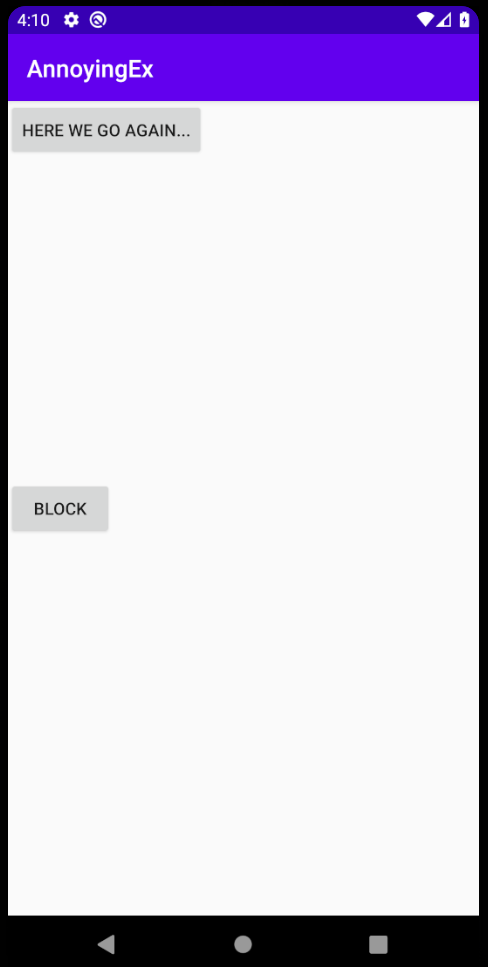
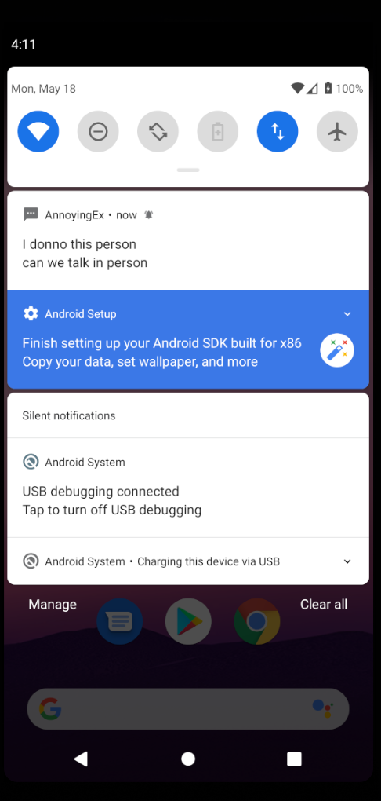
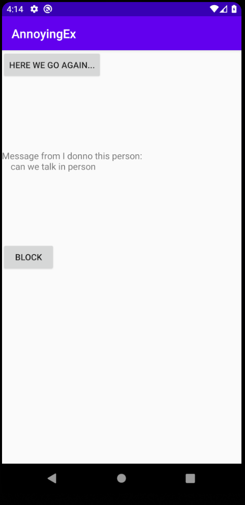

# AnnoyingEx by Sean Yang

This app can schedule a reoccuring event where an annoying ex is constantly sending messages to your phone even when the app is closed. A user can start the event or stop the event manually.

## Screenshots

## extra-credit
I've completed extra credit 